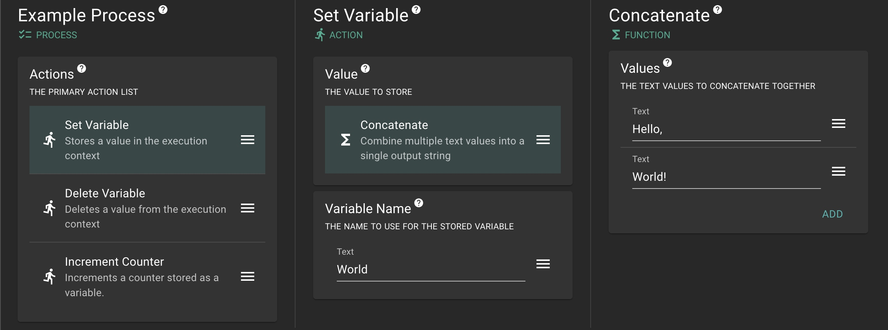

> ## Status
>
> * [2023-12-28] I've decided to clean this project up and bring it public, despite it very much still being a work-in-progress. See the [roadmap](#roadmap) section below for details on how I'd like to evolve things from here.

# LogicForge

LogicForge is a library that facilitates the creation of "advanced editing" features that users can leverage to create complex logic for later execution. Example use cases are:

* For a content management system, allowing authors to target or secure content based on a user profile
* For a CDN, allowing admins to set up A/B testing or routing based on user profile
* For analytics processing, allowing users to set up custom alerts and/or custom actions based on input filters

The system works by allowing developers to annotate Java methods as _actions_ (methods that hava side effects) or _functions_ (methods that return a value, but do not have side effects; i.e., "pure functions"). The library analyzes those methods through reflection to characterize the parameters and return type. 

```java
@Action
public static void setVariable(
        ModifiableExecutionContext context,
        String variableName,
        String variableValue
      ) {
    context.put(variableName, variableValue);
}

@Funtion
public static int addIntegers(int a, int b) {
    return a + b;
}
```
_Example Java action and function_

Actions and function methods can also include "injectable" parameters, such as the `context` parameter in the `setVariable` action above. These can be included in method signatures to be injected by the library at runtime.

The introspected method data is used to generate UI elements that end users can leverage to compose those actions and functions with variables and static values to create custom logic without code.

The generated UI components give users the ability to:

* Add/remove/reorder actions in a process
* Edit input values, including using functions or variable references as inputs
* Add/remove/reorder inputs for multi-input parameters

The UI is generated from the developer-supplied configuration, meaning users will only have access to capabilities the developer has chosen. All displayed text is provided via a translation dictionary, allowing text to be translated and altered without updating any code.



At runtime, the user-supplied logic is compiled into a Java class that can be executed against input variables (a user profile, an HTTP request).

```java
package io.metalmind.generated.action.pid_0;

import io.logicforge.core.engine.Action;
import io.logicforge.core.engine.ActionExecutor;
import io.logicforge.core.engine.ChildActionsImpl;
import io.logicforge.core.engine.Process;
import io.logicforge.core.engine.compile.CompilationProcessBuilderTest;
import io.logicforge.core.exception.ProcessExecutionException;
import io.logicforge.core.injectable.ChildActions;
import io.logicforge.core.injectable.ExecutionContext;
import io.logicforge.core.injectable.ModifiableExecutionContext;

import java.util.concurrent.atomic.AtomicLong;

public class Process0 implements Process {

    private final AtomicLong executionCount = new AtomicLong(0L);

    private final CompilationProcessBuilderTest.Functions var0;
    private final Action[] children0;

    public Process0(final CompilationProcessBuilderTest.Functions var0) {
        this.var0 = var0;
        this.children0 = new Action[]{new Action0()};
    }


    public void execute(final ModifiableExecutionContext context, final ActionExecutor executor) {
        executionCount.getAndIncrement();
        final ChildActions rootActions = new ChildActionsImpl(executor, children0);
        rootActions.executeSync(context);
    }

    public String getProcessId() {
        return "0";
    }

    public long getExecutionCount() {
        return executionCount.get();
    }

    private class Action0 implements Action {

        public void execute(final ModifiableExecutionContext context) throws ProcessExecutionException {
            final ExecutionContext readonlyContext = context.getReadonlyView();

            var0.recordPair(var0.concat("Hello, ", "World!"), var0.add(Integer.valueOf("3"), Integer.valueOf("5")));
        }

        public String getName() {
            return "recordPair";
        }

        public String getProcessId() {
            return "0";
        }

        public String getPath() {
            return "root";
        }

        public int getIndex() {
            return 0;
        }

        public String toString() {
            return "var0.recordPair(var0.concat(\"Hello, \", \"World!\"), var0.add(Integer.valueOf(\"3\"), Integer.valueOf(\"5\")))";
        }
    }
}
```
_Generated Java code implementing a single-action process_

## Concepts

### Context

The input set of variables against which a process is executed. Processes can modify the context through actions (adding/setting/deleting variables), and the process container might examine the output context for downstream actions. For example, a process implementing a web server might be initialized with a variable containing an HTTP request object, and might expect an output variable containing an HTTP response object.

### Process

A list of actions to be performed against a given input context. A process specification can include guarantees about input variables (preconditions) and expectations about output variables (post-conditions).

### Action

A function with side effects, and which does not produce an output value. Example actions might include:

* Setting a context variable
* Reading file data into a variable
* Making a web request and storing a response object in a variable

Each action can include developer-defined parameters that control how the action executes. For example, an action that makes an HTTP request might provide the following parameters:

* URL (text)
* HTTP method (enumerated text, including GET, POST, etc.)
* Headers (a list of key/value pairs)
* Payload (text)

Actions are also able to include one or more lists of child actions. Use cases include:

* Conditional branch execution (ex: given a boolean input, execute one of two branches)
* Concurrency (given a list of independent actions, execute them in parallel using a thread pool)

### Function

A "pure function", or one that produces an output value but no side effects. Example functions might include:

* Concatenating a list of input values into a single output string
* Determining the maximum value in a list of numerical inputs
* Deriving a cryptographic signature of some input message, given a key

Like actions, functions also allow developer-defined parameters that influence their execution.

### Input

An input is a value that is computed at runtime to represent a parameter for an action or function. An input is defined by the following attributes:

* Type (e.g., text, integer, boolean)
* Multi (whether the input is a list or a single value)
* Required (whether an input is required)
  * NOTE: future plans include more fine-grained validations (ex: min/max value count)

Inputs are configured by users for each selected action/function. Inputs are text by default (validated to match the required type), but any input can also be supplied by:

* A context variable
* A function

Given this, users are able to create nested functions that allow precise and expansive control over a process without expensive developer customizations.

### Engine

A developer-provided configuration that controls how users are able to define their processes. This includes:

* Supported process specifications
* Available actions
* Available functions

## Customization

Developers are able to customize how an engine operates. In addition to controlling which of the builtin actions/functions are available to users, developers can:

* Create new actions
* Create new functions
* Override/upgrade existing actions/functions
* Add new types, including enumerated values

The following sections detail these customizations.

### Creating a new action

To create a new action, developers just need to supply the engine with a reference to the method name and containing class. Methods will be automatically analyzed to determine the list of input parameters. Actions can also define "injected" parameters that provide additional functionality. Injected parameters include:

* The execution context ([ModifiableExecutionContext](core/src/main/java/io/logicforge/core/injectable/ModifiableExecutionContext.java)), which provides the action context with the ability to get and set variables
* Child actions ([ChildActions](core/src/main/java/io/logicforge/core/injectable/ChildActions.java)), to allow definition of lists of child action which the parent action can execute.

The action will be rejected if it has a non-null return type, or if it defines unsupported input parameter types. Since parameter names are by default obtained via introspection, classes must be compiled with the `-parameters` flag to ensure these names are available at runtime. In cases where this is not feasible, or the parameter is renamed, the @Input annotation can be used to specify or override the parameter name.

Actions are stored and looked up by name. By default, the method name is used as this value, but this can be overridden using the @LogicForgeAction annotation. Both action and parameter names should be kept constant once in use to avoid breaking stored processes.

### Creating a new function

Similar to creating an action, creating a function just requires a reference to the Java method representing the function. In addition to user-supplied parameters, the following injected parameters are available:

* The execution context ([ExecutionContext](core/src/main/java/io/logicforge/core/injectable/ExecutionContext.java)), which provides the function with the ability to read variables from the context

Although not enforced, functions must take care to be free of side effects. Side effects in functions can lead to processes executing unpredictably.

Like actions, functions are looked up by name. Therefore, care must be taken not to change the name of an in-use function name (or to supply an override via the @LogicForgeFunction annotation).

### Non-Static Actions and Functions

While actions and functions should be designed as static whenever possible, there are use cases (for actions especially) where referencing local instance variables is required. For example, an action that executes a web request might wish to route all outgoing requests through a specially-configured client. Where static action and function methods can be referenced by method and class name only, non-static methods require a class instance to be constructed.


### Overriding or Upgrading Actions or Functions

Since actions and functions are looked up by name, replacing it with a new function is as simple as matching the existing name (either implicitly via the method name itself, or explicitly using the [@Action](core/src/main/java/io/logicforge/core/annotations/Action.java) or [@Function](core/src/main/java/io/logicforge/core/annotations/Function.java) annotations). When changing the implementation of an in-use action or function, obey the following rules to avoid breaking existing processes:

* Optional parameters can be freely added or removed
* Required parameters can be removed, but not added
* Parameter types can be widened (changed to a supertype), but not narrowed (changed to a subtype)
* Non-multi parameters can be converted to multi, but not vice-versa
* Injected parameters (those not configured by users) can be added or removed without restriction

Note that attempting to add multiple actions/functions with the same name will lead to an error, so changing an implementing method requires removing the old implementation from the engine configuration.

## Roadmap

This section contains prospective future releases.

* MVP (`0.1.0`)
  * Frontend:
    * Add/edit/remove/reorder actions
    * Type-dependent input validation
    * Variable support (including autocomplete and type-inference)
  * Backend
    * Basic set of builtin actions/functions/converters
    * Thread management, including timeouts
  * Demo:
    * Backend:
      * Example custom action & function
      * Example persistence layer (MongoDB)
      * Example web layer (Spring Boot Controllers)
    * Frontend:
      * Wrapper application
        * Author a single "Web Server" process that responds to HTTP requests
        * Submit web requests to test endpoint (configured to call authored process) via HTTP console
* Hardening
  * Unit tests for core and frontend libraries
  * Cucumber integration tests for demo
  * Add Reflection-based processor for non-JVM systems
  * Solidify developer documentation
* Performance (`1.0.0`)
  * Write performance test scripts
  * ASM-based class generation
  * Maven Central release
* Capability Plugins
  * Add capability modules that can be included to extend the engine. Plugin modules will include functions and/or actions aligned with a specific problem domain. Potential modules:
    * HTTP (send and/or process HTTP requests)
    * Structure (utilities for dealing with structured data, including JSON and YAML)
    * Crypto (encryption, decryption, hashing)
    * File (operations for interacting with a filesystem)
    * Image (ImageMagick wrapper)
    * AI (submit prompts to a LLM (ollama?))
* Observability
* Advanced Management
  * Process/Action-specific timeouts
  * Complexity budgets
  * Automated caching & invalidation of Processes and Engines